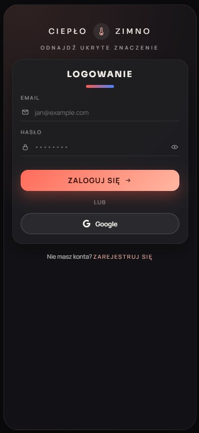
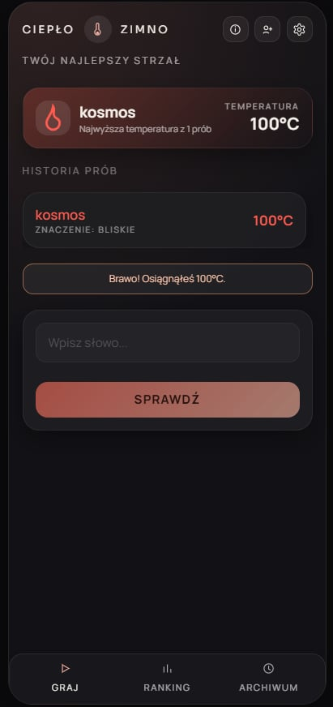
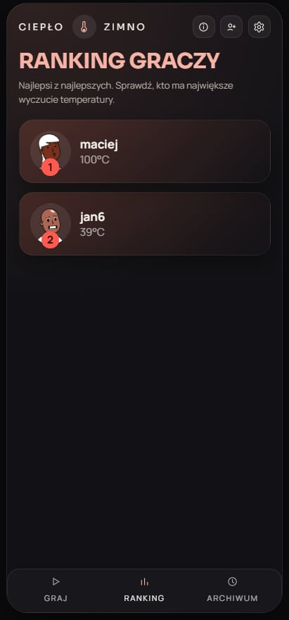
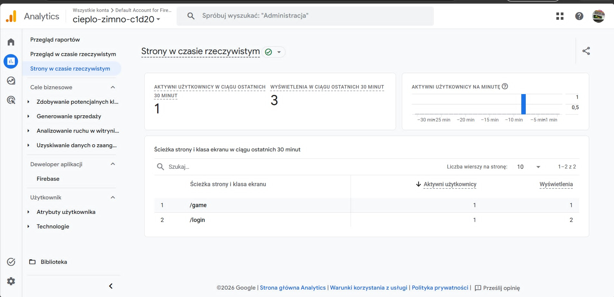

# Ciepło–Zimno

> Codzienna gra słowna oparta na podobieństwie semantycznym — im bliżej znaczeniowo Twoje słowo, tym wyższa temperatura.

[](https://cieplo-zimno.vercel.app/login)

---

## Opis

**Ciepło–Zimno** to aplikacja webowa inspirowana grami typu *hot & cold*, w której celem jest odgadnięcie ukrytego słowa dnia. W przeciwieństwie do Wordle, gra nie ocenia liter — ocenia **podobieństwo znaczeniowe** między Twoim strzałem a hasłem.

Każdego dnia wszyscy gracze otrzymują to samo słowo. Po wpisaniu propozycji system zwraca temperaturę w skali od zimna do gorąca, co pozwala iteracyjnie zbliżać się do rozwiązania. Projekt łączy nowoczesny frontend w React z backendem Express i analityką użytkownika (Google Analytics 4, Hotjar).

---

## Funkcje

| Moduł | Opis |
|-------|------|
| **Gra** | Codzienne hasło, nieograniczone próby, historia strzałów z temperaturą |
| **Home** | Podsumowanie najlepszego strzału, kalendarz postępów, aktywność znajomych |
| **Ranking** | Tablica liderów graczy |
| **Archiwum** | Historia poprzednich gier z procentem postępu |
| **Znajomi** | Sugestie kontaktów i link zaproszeniowy |
| **Auth** | Rejestracja i logowanie przez Firebase (Email/Password + Google) |
| **Ustawienia** | Zmiana hasła, preferencje konta |
| **Analityka** | Śledzenie tras (GA4), opcjonalnie Hotjar |

---

## Tech Stack

### Frontend (`app/`)

| Technologia | Rola |
|-------------|------|
| **React 19** | UI i komponenty |
| **TypeScript** | Typowanie statyczne |
| **Vite** | Bundler i dev server |
| **React Router** | Routing SPA, trasy chronione |
| **Firebase Auth** | Uwierzytelnianie użytkowników |
| **Firestore** | Profile użytkowników |
| **react-ga4** | Google Analytics 4 |
| **@hotjar/browser** | Analityka behawioralna |

### Backend (`server/`)

| Technologia | Rola |
|-------------|------|
| **Express** | REST API |
| **sql.js** | Baza SQLite (plik lokalnie, `/tmp` na Vercel) |
| **Node.js crypto** | Hashowanie haseł (`scrypt`) |

### Infrastruktura

| Usługa | Rola |
|--------|------|
| **Vercel** | Hosting frontendu + serverless API |
| **Firebase Console** | Auth, Firestore, autoryzowane domeny |

---

## Instalacja

### Wymagania

- **Node.js** 18+
- **npm** 9+
- Konto **Firebase** z włączonym Authentication

### 1. Klonowanie repozytorium

```bash
git clone https://github.com/KamilRayski/cieplo-zimno.git
cd cieplo-zimno
```

### 2. Backend (port `4000`)

```bash
cd server
npm install
npm run dev
```

### 3. Frontend (port `5173`)

W osobnym terminalu:

```bash
cd app
npm install
cp .env.example .env
# Uzupełnij app/.env kluczami z Firebase Console
npm run dev
```

Aplikacja frontendowa proxy'uje żądania `/api/*` do backendu dzięki konfiguracji w `vite.config.ts`.

---

## Użycie

1. Otwórz **http://localhost:5173** (lub [demo na Vercel](https://cieplo-zimno.vercel.app/login)).
2. Zarejestruj się lub zaloguj (Email/Password albo Google).
3. Przejdź do ekranu **Gra** (`/game`) i wpisz pierwsze słowo.
4. Obserwuj temperaturę odpowiedzi i dopasowuj kolejne strzały.
5. Po trafieniu (100°C) zobacz ekran wyniku (`/result`).

### Skala temperatury

| Zakres | Etykieta | Znaczenie |
|--------|----------|-----------|
| **> 50°C** | Gorąco | Bardzo bliskie znaczeniowo — synonim lub ścisłe powiązanie |
| **0°C – 50°C** | Ciepło | Dobry kierunek — ta sama kategoria tematyczna |
| **< 0°C** | Zimno | Inny temat — spróbuj innego obszaru skojarzeń |

> Przykład: jeśli hasłem jest `PIES`, słowo `KOT` będzie gorące, a `KRZESŁO` — zimne.

---

## Przykłady

### Uruchomienie gry (API)

```bash
# Start sesji gry (wymaga authSessionId z backendu)
curl -X POST http://localhost:4000/api/game/start \
  -H "Content-Type: application/json" \
  -d '{"authSessionId": "twoj-auth-session-id"}'
```

Odpowiedź:

```json
{
  "data": {
    "sessionId": "uuid-sesji-gry",
    "guesses": [],
    "isWon": false,
    "attemptsLeft": 10,
    "maxAttempts": 10
  }
}
```

### Wysłanie strzału

```bash
curl -X POST http://localhost:4000/api/game/guess \
  -H "Content-Type: application/json" \
  -d '{
    "sessionId": "uuid-sesji-gry",
    "authSessionId": "twoj-auth-session-id",
    "guess": "KOT"
  }'
```

Odpowiedź:

```json
{
  "data": {
    "sessionId": "uuid-sesji-gry",
    "guesses": [
      { "word": "KOT", "temperature": 85, "result": ["absent"] }
    ],
    "isWon": false,
    "temperature": 85,
    "result": ["absent"]
  }
}
```

### Wywołanie API z frontendu

```typescript
import { apiRequest } from './lib/api'
import { getAuthSessionId } from './lib/session'

const payload = await apiRequest('/game/guess', {
  method: 'POST',
  json: {
    sessionId: 'uuid-sesji-gry',
    authSessionId: getAuthSessionId(),
    guess: 'KOT',
  },
})
```

---

## Konfiguracja

### Zmienne środowiskowe (`app/.env`)

Skopiuj szablon z `.env.example`:

```env
VITE_FIREBASE_API_KEY=twoj-api-key
VITE_FIREBASE_AUTH_DOMAIN=twoj-projekt.firebaseapp.com
VITE_FIREBASE_PROJECT_ID=twoj-projekt
VITE_FIREBASE_STORAGE_BUCKET=twoj-projekt.firebasestorage.app
VITE_FIREBASE_APP_ID=1:123456789:web:abcdef
VITE_FIREBASE_MESSAGING_SENDER_ID=123456789

VITE_GA_MEASUREMENT_ID=G-XXXXXXXX
VITE_HOTJAR_SITE_ID=1234567
```

| Zmienna | Opis |
|---------|------|
| `VITE_FIREBASE_*` | Konfiguracja web app z [Firebase Console](https://console.firebase.google.com) |
| `VITE_GA_MEASUREMENT_ID` | ID pomiaru Google Analytics 4 |
| `VITE_HOTJAR_SITE_ID` | Opcjonalnie: Site ID Hotjar |

### Firebase Authentication

W Firebase Console:

1. **Authentication** → Get started
2. **Sign-in method** → **Email/Password** → Enable
3. **Sign-in method** → **Google** → Enable
4. **Settings** → Authorized domains → dodaj `localhost` oraz `cieplozimno.vercel.app`

### Backend

| Zmienna | Domyślnie | Opis |
|---------|-----------|------|
| `PORT` | `4000` | Port serwera Express (lokalnie) |
| `NODE_ENV` | — | `production` na Vercel |
| `VERCEL` | — | Ustawiane automatycznie na Vercel |

---

## API

Wszystkie endpointy zwracają JSON w formacie `{ "data": ... }`. Błędy: `{ "error": "..." }` z odpowiednim kodem HTTP.

### Health

| Metoda | Endpoint | Auth | Opis |
|--------|----------|------|------|
| `GET` | `/api/health` | — | Status serwera |

### Auth

| Metoda | Endpoint | Auth | Opis |
|--------|----------|------|------|
| `POST` | `/api/auth/register` | — | Rejestracja (name, email, password) |
| `POST` | `/api/auth/login` | — | Logowanie (email, password) |
| `POST` | `/api/auth/google` | — | Sync konta Google (email, name) |
| `POST` | `/api/auth/change-password` | session | Zmiana hasła |
| `GET` | `/api/auth/me` | query `sessionId` | Bieżący użytkownik |
| `POST` | `/api/auth/logout` | — | Wylogowanie |

### Gra i dane

| Metoda | Endpoint | Auth | Opis |
|--------|----------|------|------|
| `POST` | `/api/game/start` | `authSessionId` | Start / wznowienie sesji gry |
| `POST` | `/api/game/guess` | `authSessionId` | Wysłanie strzału (sessionId, guess) |
| `GET` | `/api/home` | opcjonalnie `sessionId` | Dashboard — best shot, znajomi |
| `GET` | `/api/leaderboard` | — | Ranking graczy |
| `GET` | `/api/archive` | query `authSessionId` | Archiwum gier użytkownika |
| `GET` | `/api/friends` | query `authSessionId` | Znajomi i link zaproszeniowy |

> Uwierzytelnianie w API: przekaż `authSessionId` w body (POST) lub query string (GET). Identyfikator pochodzi z synchronizacji Firebase → backend (`authSync.ts`).

---

## Struktura folderów

```
cieplo-zimno/
├── app/                          # Frontend (React + Vite)
│   ├── public/                   # Assety statyczne
│   ├── src/
│   │   ├── auth/                 # AuthContext, logika sesji Firebase
│   │   ├── components/           # Komponenty UI (layout, ikony, analityka)
│   │   ├── lib/                  # API client, Firebase, formatowanie, sesja
│   │   ├── pages/                # Widoki (routing)
│   │   ├── App.tsx               # Definicja tras React Router
│   │   └── main.tsx              # Entry point
│   ├── .env.example              # Szablon zmiennych środowiskowych
│   └── vercel.json               # SPA rewrite (deploy z katalogu app/)
│
├── server/                       # Backend (Express)
│   ├── data/
│   │   └── ranking.json          # Mapa podobieństw semantycznych (temperatury)
│   ├── db.js                     # Warstwa SQLite (sql.js)
│   ├── game.js                   # Logika gry i scoring
│   ├── seedData.js               # Pula haseł dziennych
│   └── index.js                  # REST API
│
├── api/
│   └── index.js                  # Entry point serverless (Vercel)
│
├── vercel.json                   # Konfiguracja monorepo na Vercel
└── package.json                  # Zależności współdzielone (Express, sql.js)
```

### Trasy frontendu

| Trasa | Dostęp | Opis |
|-------|--------|------|
| `/login`, `/register` | Publiczny | Logowanie i rejestracja |
| `/game` | Chroniony | Ekran gry |
| `/home` | Chroniony | Strona główna z kalendarzem |
| `/ranking` | Chroniony | Ranking |
| `/archive` | Chroniony | Archiwum gier |
| `/calendar` | Chroniony | Widok kalendarza |
| `/friends` | Chroniony | Znajomi |
| `/settings` | Chroniony | Ustawienia konta |
| `/change-password` | Chroniony | Zmiana hasła |
| `/info` | Chroniony | Zasady gry |
| `/contact` | Chroniony | Formularz kontaktowy |
| `/result` | Chroniony | Ekran wyniku |
| `*` | Publiczny | Strona 404 |

---

## Deploy

### Vercel (frontend + API)

Repozytorium jest skonfigurowane jako monorepo z plikiem `vercel.json` w katalogu głównym:

- **Frontend** — build statyczny z `app/` (`npm run build` → `dist/`)
- **API** — serverless function z `api/index.js` (proxy do `server/index.js`)

Kroki:

1. Import repozytorium na [vercel.com](https://vercel.com)
2. Dodaj zmienne `VITE_*` w **Settings → Environment Variables**
3. Deploy — routing `/api/*` obsługiwany automatycznie

Plik `app/vercel.json` zapewnia obsługę SPA (React Router) przy deployu wyłącznie katalogu `app/`.

### Tylko backend (lokalnie / Railway)

```bash
cd server
npm install
npm start
```

Ustaw zmienną `PORT` zgodnie z hostingiem. Frontend musi mieć dostęp do API (proxy Vite lokalnie lub wspólny deploy na Vercel).

---

## Documentation / Screenshots

### Application Screenshots

Główne widoki aplikacji — interfejs logowania, rozgrywka oraz ranking. Pokazują layout, nawigację i kluczowe elementy UX projektu.

| Logowanie | Gra | Ranking |
|:---------:|:---:|:-------:|
|  |  |  |
| Firebase Auth (Email/Password + Google) | Strzały z temperaturą i historią | Tablica liderów graczy |

### Google Analytics Screenshots

**Google Analytics dashboard screenshots** — raporty GA4 zintegrowane przez `react-ga4` i `AnalyticsListener`. Pokazują ruch na stronie, konwersje między trasami (`/game`, `/ranking` itd.) oraz zachowanie użytkowników w czasie rzeczywistym.

| Realtime |
|:--------:|
|  |
| Przegląd ruchu, źródła i zdarzenia, aktywni użytkownicy na żywo |

### Hotjar Screenshots

**Heatmaps / recordings / insights z Hotjar** — materiały z `@hotjar/browser` (oraz opcjonalnie Contentsquare UXA w `index.html`). Ilustrują, gdzie użytkownicy klikają, jak scrollują ekran gry oraz jak przechodzą przez flow logowania i rozgrywki.

| Heatmapy | Nagrania sesji |
|:--------:|:--------------:|
|  |  |
| Mapy kliknięć i scrollowania | Replay sesji użytkownika w aplikacji |

---

## Roadmap

- [ ] Uzupełnienie plików PNG w `docs/screenshots/` (patrz sekcja Documentation)
- [ ] Rozszerzenie puli haseł i mapy semantycznej w `ranking.json`

---

## Contributing

Chcesz pomóc w rozwoju projektu?

1. **Fork** repozytorium
2. Utwórz branch: `git checkout -b feature/nazwa-funkcji`
3. Wprowadź zmiany i przetestuj lokalnie (backend + frontend)
4. Commit: `git commit -m "feat: krótki opis zmiany"`
5. **Push** i otwórz **Pull Request**

Przed PR uruchom linter frontendu:

```bash
cd app
npm run lint
```

---

## FAQ

<details>
<summary><strong>Czym różni się ta gra od Wordle?</strong></summary>

Wordle ocenia litery i ich pozycję. **Ciepło–Zimno** ocenia **znaczenie** słowa — dwa słowa mogą mieć zero wspólnych liter, a mimo to wysoką temperaturę (np. `PIES` i `KOT`).
</details>

<details>
<summary><strong>Skąd pochodzą temperatury?</strong></summary>

Backend wczytuje mapę podobieństw z pliku `server/data/ranking.json`. Dla każdego hasła dnia przechowywane są predefiniowane temperatury dla popularnych strzałów. Trafienie dokładne zwraca **100°C**.
</details>

<details>
<summary><strong>Dlaczego jest Firebase i osobny backend?</strong></summary>

**Firebase Auth** obsługuje logowanie w przeglądarce (Email/Password, Google). Backend Express utrzymuje sesje gry, ranking, archiwum i dane SQLite. Po zalogowaniu Firebase frontend synchronizuje użytkownika z API przez `authSync.ts`.
</details>

<details>
<summary><strong>Czy hasło dnia jest takie samo dla wszystkich?</strong></summary>

Tak. Hasło wybierane jest deterministycznie z puli `seedData.js` na podstawie numeru dnia — wszyscy gracze tego samego dnia dostają to samo słowo.
</details>

<details>
<summary><strong>Backend nie startuje lokalnie — co sprawdzić?</strong></summary>

Upewnij się, że jesteś w katalogu `server/`, wykonałeś `npm install` i port `4000` nie jest zajęty. Frontend w dev mode wymaga działającego backendu dla endpointów `/api/*`.
</details>

---

<p align="center">
  <sub>Zbudowane z React, Express i Firebase · Demo: <a href="https://cieplozimno.vercel.app/login">cieplozimno.vercel.app</a></sub>
</p>
